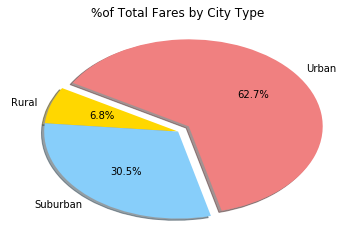
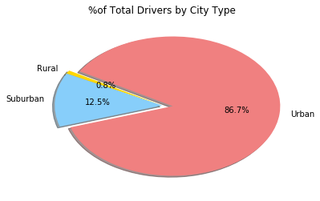

```python
# %matplotlib notebook - this function only updates the existing plot .. that is why multiple plots are being overwitten
```


```python
import pandas as pd
import numpy as np
import matplotlib.pyplot as plt
import seaborn as sns
```


```python
# File to Load 
city_data_load = "raw_data/city_data.csv"
ride_data_load = "raw_data/ride_data.csv"

city_data = pd.read_csv(city_data_load)
ride_data = pd.read_csv(ride_data_load)

pyber_data = pd.merge(ride_data, city_data, how="left", on=["city"])

pyber_data.head()
```


<div>
<style scoped>
    .dataframe tbody tr th:only-of-type {
        vertical-align: middle;
    }

    .dataframe tbody tr th {
        vertical-align: top;
    }

    .dataframe thead th {
        text-align: right;
    }
</style>
<table border="1" class="dataframe">
  <thead>
    <tr style="text-align: right;">
      <th></th>
      <th>city</th>
      <th>date</th>
      <th>fare</th>
      <th>ride_id</th>
      <th>driver_count</th>
      <th>type</th>
    </tr>
  </thead>
  <tbody>
    <tr>
      <th>0</th>
      <td>Lake Jonathanshire</td>
      <td>2018-01-14 10:14:22</td>
      <td>13.83</td>
      <td>5739410935873</td>
      <td>5</td>
      <td>Urban</td>
    </tr>
    <tr>
      <th>1</th>
      <td>South Michelleport</td>
      <td>2018-03-04 18:24:09</td>
      <td>30.24</td>
      <td>2343912425577</td>
      <td>72</td>
      <td>Urban</td>
    </tr>
    <tr>
      <th>2</th>
      <td>Port Samanthamouth</td>
      <td>2018-02-24 04:29:00</td>
      <td>33.44</td>
      <td>2005065760003</td>
      <td>57</td>
      <td>Urban</td>
    </tr>
    <tr>
      <th>3</th>
      <td>Rodneyfort</td>
      <td>2018-02-10 23:22:03</td>
      <td>23.44</td>
      <td>5149245426178</td>
      <td>34</td>
      <td>Urban</td>
    </tr>
    <tr>
      <th>4</th>
      <td>South Jack</td>
      <td>2018-03-06 04:28:35</td>
      <td>34.58</td>
      <td>3908451377344</td>
      <td>46</td>
      <td>Urban</td>
    </tr>
  </tbody>
</table>
</div>


```python
grouped_type_df = pyber_data.groupby(["city","type"])
city_total_rides = grouped_type_df["ride_id"].count()
city_driver_count = grouped_type_df["driver_count"].mean()
city_avg_fare = grouped_type_df["fare"].mean()
city_final_df = pd.DataFrame({"Average Fare": city_avg_fare,
                             "Rides Per City":city_total_rides,
                             "Driver Count":city_driver_count})
# city_final_df_ind = city_final_df.reset_index()
city_final_df.head()
# grouped_type_df.head()
# print(city_total_rides)
```


<div>
<style scoped>
    .dataframe tbody tr th:only-of-type {
        vertical-align: middle;
    }

    .dataframe tbody tr th {
        vertical-align: top;
    }

    .dataframe thead th {
        text-align: right;
    }
</style>
<table border="1" class="dataframe">
  <thead>
    <tr style="text-align: right;">
      <th></th>
      <th></th>
      <th>Average Fare</th>
      <th>Driver Count</th>
      <th>Rides Per City</th>
    </tr>
    <tr>
      <th>city</th>
      <th>type</th>
      <th></th>
      <th></th>
      <th></th>
    </tr>
  </thead>
  <tbody>
    <tr>
      <th>Amandaburgh</th>
      <th>Urban</th>
      <td>24.641667</td>
      <td>12</td>
      <td>18</td>
    </tr>
    <tr>
      <th>Barajasview</th>
      <th>Urban</th>
      <td>25.332273</td>
      <td>26</td>
      <td>22</td>
    </tr>
    <tr>
      <th>Barronchester</th>
      <th>Suburban</th>
      <td>36.422500</td>
      <td>11</td>
      <td>16</td>
    </tr>
    <tr>
      <th>Bethanyland</th>
      <th>Suburban</th>
      <td>32.956111</td>
      <td>22</td>
      <td>18</td>
    </tr>
    <tr>
      <th>Bradshawfurt</th>
      <th>Rural</th>
      <td>40.064000</td>
      <td>7</td>
      <td>10</td>
    </tr>
  </tbody>
</table>
</div>


```python
pyber_data_rural_df = pyber_data.loc[pyber_data["type"] == "Rural", :]
ride_city_df_group_rural = pyber_data_rural_df.groupby(["city","type"])
ride_city_df_rideid_ctr_rural = ride_city_df_group_rural["ride_id"].count()
ride_city_df_driver_ctr_rural = ride_city_df_group_rural["driver_count"].count()
ride_city_df_avgfare_rural = ride_city_df_group_rural["fare"].mean()

pyber_data_urban_df = pyber_data.loc[pyber_data["type"] == "Urban", :]
ride_city_df_group_urban = pyber_data_urban_df.groupby(["city","type"])
ride_city_df_rideid_ctr_urban = ride_city_df_group_urban["ride_id"].count()
ride_city_df_driver_ctr_urban = ride_city_df_group_urban["driver_count"].count()
ride_city_df_avgfare_urban = ride_city_df_group_urban["fare"].mean()

pyber_data_suburban_df = pyber_data.loc[pyber_data["type"] == "Suburban", :]
ride_city_df_group_suburban = pyber_data_suburban_df.groupby(["city","type"])
ride_city_df_rideid_ctr_suburban = ride_city_df_group_suburban["ride_id"].count()
ride_city_df_driver_ctr_suburban = ride_city_df_group_suburban["driver_count"].count()
ride_city_df_avgfare_suburban = ride_city_df_group_suburban["fare"].mean()

# rural_driver_count = rural_cities.groupby(["city"].mean()["driver_count"])
pyber_data_urban_df.head()
```


<div>
<style scoped>
    .dataframe tbody tr th:only-of-type {
        vertical-align: middle;
    }

    .dataframe tbody tr th {
        vertical-align: top;
    }

    .dataframe thead th {
        text-align: right;
    }
</style>
<table border="1" class="dataframe">
  <thead>
    <tr style="text-align: right;">
      <th></th>
      <th>city</th>
      <th>date</th>
      <th>fare</th>
      <th>ride_id</th>
      <th>driver_count</th>
      <th>type</th>
    </tr>
  </thead>
  <tbody>
    <tr>
      <th>0</th>
      <td>Lake Jonathanshire</td>
      <td>2018-01-14 10:14:22</td>
      <td>13.83</td>
      <td>5739410935873</td>
      <td>5</td>
      <td>Urban</td>
    </tr>
    <tr>
      <th>1</th>
      <td>South Michelleport</td>
      <td>2018-03-04 18:24:09</td>
      <td>30.24</td>
      <td>2343912425577</td>
      <td>72</td>
      <td>Urban</td>
    </tr>
    <tr>
      <th>2</th>
      <td>Port Samanthamouth</td>
      <td>2018-02-24 04:29:00</td>
      <td>33.44</td>
      <td>2005065760003</td>
      <td>57</td>
      <td>Urban</td>
    </tr>
    <tr>
      <th>3</th>
      <td>Rodneyfort</td>
      <td>2018-02-10 23:22:03</td>
      <td>23.44</td>
      <td>5149245426178</td>
      <td>34</td>
      <td>Urban</td>
    </tr>
    <tr>
      <th>4</th>
      <td>South Jack</td>
      <td>2018-03-06 04:28:35</td>
      <td>34.58</td>
      <td>3908451377344</td>
      <td>46</td>
      <td>Urban</td>
    </tr>
  </tbody>
</table>
</div>


```python
plt.scatter(ride_city_df_rideid_ctr_rural, 
            ride_city_df_avgfare_rural, 
            s=10*ride_city_df_driver_ctr_rural, 
            marker="o", 
            c="coral", 
            edgecolors="black", 
            label = "Rural")
plt.scatter(ride_city_df_rideid_ctr_suburban, 
            ride_city_df_avgfare_suburban, 
            s=10*ride_city_df_driver_ctr_suburban, 
            marker="o", 
            c="skyblue", 
            edgecolors="black", 
            label = "Suburban")
plt.scatter(ride_city_df_rideid_ctr_urban, 
            ride_city_df_avgfare_urban, 
            s=10*ride_city_df_driver_ctr_urban, 
            marker="o", 
            c="gold", 
            edgecolors="black", 
            label = "Urban")

plt.title("Pyber Ride Sharing Data (2016)")
plt.xlabel("Total Number of Rides (Per City)")
plt.ylabel("Average Fare ($)")

x=city_total_rides
y=city_avg_fare
plt.grid()
lgnd = plt.legend(fontsize="small", mode="Expanded",
                 numpoints=1, scatterpoints=1,
                 loc="best", title="City Types")
lgnd.legendHandles[0]._sizes = [30]
lgnd.legendHandles[1]._sizes = [30]
lgnd.legendHandles[2]._sizes = [30]
plt.show()
plt.savefig("Pyber.png")
```


    <matplotlib.figure.Figure at 0x15df1f83f60>


```python
#% of Total Fares by City Type
tot_city_fare_type = 100 * pyber_data.groupby(["type"]).sum()["fare"] / pyber_data["fare"].sum()

plt.pie(tot_city_fare_type,
        labels =["Urban","Suburban","Rural"],
        colors =["gold","lightskyblue","lightcoral"],
        explode =[0,0,0.1],
        autopct='%1.1f%%',
        shadow =True, startangle =150)

plt.title("%of Total Fares by City Type")
plt.savefig("Fig1.png")
plt.show()
        
```





```python
#% of Total Rides by City Type
tot_city_ride_type = 100 * pyber_data.groupby(["type"]).count()["ride_id"] / pyber_data["ride_id"].count()

plt.pie(tot_city_ride_type,
        labels =["Urban","Suburban","Rural"],
        colors =["gold","lightskyblue","lightcoral"],
        explode =[0,0,0.1],
        autopct='%1.1f%%',
        shadow =True, startangle =150)

plt.title("%of Total Rides by City Type")
plt.savefig("Fig3.png")
plt.show()
        
```


```python
#% of Total Drivers by City Type
tot_city_count_type = 100 * pyber_data.groupby(["type"]).sum()["driver_count"] / pyber_data["driver_count"].sum()

plt.pie(tot_city_count_type,
        labels =["Urban","Suburban","Rural"],
        colors =["gold","lightskyblue","lightcoral"],
        explode =[0,0,0.1],
        autopct='%1.1f%%',
        shadow =True, startangle =150)

plt.title("%of Total Drivers by City Type")
plt.savefig("Fig2.png")
plt.show()
```





# Analysis

* Majority of drivers undertake ride sharing between $20 and $30 price range
* Strategy can be adopted to attract more drivers for a higher fare > $30.

